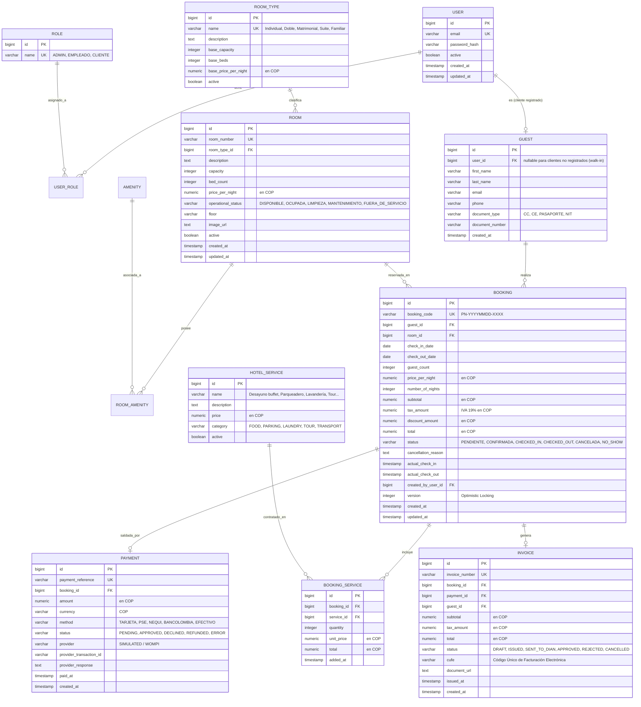

# Documento de Arquitectura y Diseño del Sistema
## Hotel "Portal del Norte" — Plataforma Web de Gestión y Reservas

---

## 1. Visión General y Objetivos

**Hotel Portal del Norte** es un sistema web completo concebido bajo arquitectura monolítica modular, desacoplada y escalable. Su propósito es centralizar la operación hotelera en dos grandes frentes:

1. **Front-office (Público & Huéspedes):**
   - Búsqueda interactiva de habitaciones por fechas y cantidad de huéspedes.
   - Motor de disponibilidad en tiempo real con control de solapamiento estricto.
   - Cotización transparente en Pesos Colombianos (COP) con desglose de impuestos y políticas de cancelación claras.
   - Creación de reservas, pasarela de pago simulada/integrada y generación de comprobantes/facturas.
   - Portal del cliente para consultar y gestionar sus reservas.

2. **Back-office (Administración y Recepción):**
   - Gestión integral del inventario de habitaciones y tipos de habitación.
   - Control del estado operativo de las habitaciones (`DISPONIBLE`, `OCUPADA`, `MANTENIMIENTO`, `LIMPIEZA`, `FUERA_DE_SERVICIO`).
   - Flujo de Check-in y Check-out con validación de pagos y consumos adicionales.
   - Tablero de control (Dashboard) con estadísticas operativas del día y métricas comerciales.

---

## 2. Stack Tecnológico

| Capa / Componente | Tecnología | Rol / Justificación |
|---|---|---|
| **Frontend Framework** | React 18 + TypeScript | UI modular, componentes fuertemente tipados. |
| **Build Tool Frontend** | Vite 5 | Compilación ultrarrápida y Hot Module Replacement. |
| **Estilos Frontend** | Tailwind CSS | Utility-first CSS para diseño responsive y estético. |
| **Estado Global Frontend** | Zustand | Estado global ligero y predecible (Auth, Booking flow). |
| **Backend Framework** | Spring Boot 3.3.x (Java 21) | Robustez, soporte LTS, Virtual Threads y ecosistema empresarial. |
| **Seguridad Backend** | Spring Security + JWT | Autenticación stateless con control de acceso granular por roles. |
| **Persistencia** | Spring Data JPA + Hibernate 6 | ORM y queries derivadas optimizadas. |
| **Base de Datos** | PostgreSQL 16 | RDBMS relacional para consistencia ACID estricta. |
| **Caché y Locks** | Redis 7 | Distributed locks para evitar sobreventa/doble reserva concurrente. |
| **Migraciones de BD** | Flyway | Control de versiones del esquema SQL. |
| **Contenedores** | Docker & Docker Compose | Entorno reproducible para desarrollo y despliegue. |

---

## 3. Modelo de Datos y Entidades

### Diagrama Entidad-Relación (ER)



---

## 4. Motor de Disponibilidad y Reglas de Negocio

### Lógica Anti-Solapamiento de Fechas

La consulta de disponibilidad garantiza que **ninguna habitación sea ofertada si se solapa con una reserva activa** (`PENDIENTE`, `CONFIRMADA`, `CHECKED_IN`).

Fórmula de solapamiento:
$$\text{Solapamiento} \iff (\text{fecha\_inicio\_reserva} < \text{fecha\_fin\_consulta}) \land (\text{fecha\_fin\_reserva} > \text{fecha\_inicio\_consulta})$$

En SQL:
```sql
SELECT r.*
FROM room r
WHERE r.active = TRUE
  AND r.operational_status = 'DISPONIBLE'
  AND r.capacity >= :guestCount
  AND r.id NOT IN (
      SELECT b.room_id
      FROM booking b
      WHERE b.status IN ('PENDIENTE', 'CONFIRMADA', 'CHECKED_IN')
        AND b.check_in_date < :requestedCheckOut
        AND b.check_out_date > :requestedCheckIn
  );
```

### Prevención de Doble Reserva (Concurrencia)
1. **Lock Distribuido con Redis:** Al momento de ejecutar el POST de reserva, se adquiere un candado sobre la clave `lock:room:{roomId}:{checkIn}_{checkOut}` con TTL de 10 segundos.
2. **Re-validación en Backend:** Antes de insertar la reserva, se re-ejecuta la comprobación en la base de datos dentro de una transacción serializable o con bloqueo optimista (`@Version`).

---

## 5. Matriz de Roles y Permisos

| Módulo / Acción | ADMIN | EMPLEADO | CLIENTE |
|---|:---:|:---:|:---:|
| **Gestión de Usuarios y Empleados** | ✅ Completo | ❌ Sin acceso | ❌ Sin acceso |
| **Configuración de Tipos y Habitaciones** | ✅ Completo | 👁 Solo lectura | 👁 Catálogo público |
| **Cambio de Estado Operativo de Habitación** | ✅ | ✅ | ❌ |
| **Consulta de Disponibilidad y Tarifas** | ✅ | ✅ | ✅ |
| **Creación de Reservas** | ✅ Para cualquier cliente | ✅ En recepción (walk-in) | ✅ Propias |
| **Check-in y Check-out** | ✅ | ✅ | ❌ |
| **Cancelación de Reservas** | ✅ Sin restricción | ✅ Según política | ✅ Propias (con política) |
| **Gestión de Pagos** | ✅ Auditoría completa | ✅ Registro y cobro | ✅ Pago online |
| **Facturación** | ✅ Emisión y consulta | ✅ Consulta y emisión | ✅ Descarga de facturas propias |
| **Dashboard y Estadísticas** | ✅ Estadísticas globales | ✅ Vista operativa del día | ❌ |

---

## 6. Políticas de Cancelación (Hotel Portal del Norte)

1. **Cancelación Gratuita:** Si el cliente cancela con al menos **48 horas** de anticipación a la fecha y hora de Check-in oficial (15:00 hrs del día de llegada).
2. **Cancelación Tardía:** Si se cancela con menos de 48 horas, se aplica una penalidad correspondiente al valor de la **primera noche de estancia** (o el 50% del total, según configuración).
3. **No-Show (No presentación):** Si el huésped no se presenta antes de las 23:59 del día de check-in y no notifica al hotel, la reserva pasa a estado `NO_SHOW` y se retiene el cargo de penalidad.
4. **Transparencia:** Las condiciones exactas se calculan y visualizan de forma obligatoria en la pantalla de cotización antes del pago.

---

## 7. Arquitectura Desacoplada de Pagos y Facturación

### Pagos
- Interfaz `PaymentProvider` con implementación por defecto `SimulatedPaymentProvider` (ideal para desarrollo/pruebas locales con aprobación/rechazo configurable) y preparado para conectarse a pasarelas colombianas (Wompi / Mercado Pago) mediante webhook y firma criptográfica.

### Facturación Electrónica
- Interfaz `InvoiceProvider` con implementación `LocalInvoiceProvider` que genera comprobantes internos con numeración consecutiva, cálculo de IVA (19%) y estructura de datos lista para interoperar con un Proveedor Tecnológico DIAN cuando se pase a producción.
