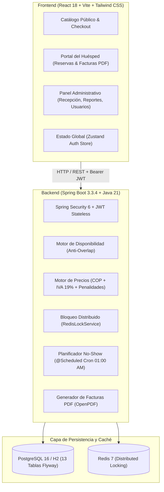

# Manual Integral de Arquitectura, Funcionalidades y Operación del Sistema
## Hotel "Portal del Norte" — Plataforma Web Profesional de Gestión y Reservas

---

## 1. Resumen Ejecutivo del Proyecto

**Hotel Portal del Norte** es una plataforma web integral de nivel empresarial diseñada para automatizar y optimizar todos los procesos del ciclo de vida hotelero, dividida en dos grandes interfaces:
1. **Front-office (Portal Público y Área del Huésped):** Permite a los clientes explorar el catálogo de habitaciones, consultar disponibilidad en tiempo real con motor anti-solapamiento, cotizar estancias en Pesos Colombianos (COP) con impuestos DIAN, reservar en un flujo de 3 pasos, pagar electrónicamente y descargar sus facturas electrónicas con CUFE en formato PDF.
2. **Back-office (Panel Administrativo y de Recepción):** Permite al personal del hotel gestionar el inventario de habitaciones, controlar estados operativos (`DISPONIBLE`, `OCUPADA`, `LIMPIEZA`, `MANTENIMIENTO`, `FUERA_DE_SERVICIO`), ejecutar Check-ins y Check-outs, administrar el personal, configurar servicios adicionales y visualizar métricas financieras en tiempo real.

---

## 2. Arquitectura Técnica y Stack Tecnológico



### Tecnologías Utilizadas
- **Backend:** Java 21, Spring Boot 3.3.4, Spring Data JPA / Hibernate 6, Spring Security 6, JJWT (0.12.6), Flyway Migrations, OpenPDF, OpenAPI 3 / Swagger.
- **Frontend:** React 18, TypeScript, Vite 5, Tailwind CSS, Lucide Icons, Date-fns, Zustand, Axios.
- **Bases de Datos & Caché:** PostgreSQL 16 (producción) / H2 in-memory (desarrollo local), Redis 7.
- **Infraestructura:** Docker & Docker Compose multi-stage con Nginx Alpine y Eclipse Temurin JRE 21.

---

## 3. Reglas de Negocio y Algoritmos Centrales

### 3.1 Motor de Disponibilidad Anti-Solapamiento
Para garantizar que **nunca se oferte una habitación física con fechas cruzadas**, el sistema evalúa la siguiente fórmula matemática en base de datos:
$$\text{Existe Solapamiento} \iff (\text{Fecha Llegada Reserva} < \text{Fecha Salida Solicitada}) \land (\text{Fecha Salida Reserva} > \text{Fecha Llegada Solicitada})$$

Solo se ofertan habitaciones cuyo estado operativo sea `DISPONIBLE`, con capacidad suficiente ($\ge$ huéspedes solicitados) y que no tengan reservas activas (`PENDIENTE`, `CONFIRMADA`, `CHECKED_IN`) en ese rango.

### 3.2 Prevención de Sobreventa con Lock Distribuido en Redis
Cuando un usuario pulsa *Pagar y Confirmar Reserva*, el backend ejecuta `RedisLockService.executeWithLock(...)` adquiriendo un candado atómico:
`lock:room:{roomId}:{checkIn}_{checkOut}` con TTL de 10 segundos. Si dos usuarios intentan pagar la misma habitación al mismo milisegundo, el segundo recibe de inmediato un código HTTP `409 Conflict` protegiendo la integridad del inventario.

### 3.3 Política de Cancelación y Penalidad
- **Cancelación Gratuita:** Si se cancela con **48 horas o más** de anticipación respecto a la hora oficial de check-in (15:00 hrs del día de llegada). Reembolso total del 100%.
- **Cancelación Tardía:** Si se cancela con **menos de 48 horas**, el sistema calcula y retiene como penalidad el valor de la **primera noche de estancia en COP**.
- **No-Show Automatizado:** Una tarea programada `@Scheduled(cron = "0 0 1 * * ?")` se ejecuta todas las noches a la 01:00 AM para marcar como `NO_SHOW` las reservas pasadas no presentadas, liberando la habitación para el inventario disponible.

### 3.4 Cotización y Facturación DIAN
- Todos los valores se calculan estrictamente en el backend en Pesos Colombianos (COP).
- Se aplica el **IVA del 19%** (DIAN) sobre el subtotal de alojamiento y servicios.
- Cada factura aprobada genera automáticamente un **CUFE** (Código Único de Facturación Electrónica) de 64 caracteres hexadecimales y comprobante PDF descargable.

---

## 4. Guía Detallada de Páginas y Flujos de Usuario

### 🌐 4.1 Frente Público & Huéspedes

#### 1. Página de Inicio (`/`)
- **Hero Interactivo:** Encabezado con imagen de fondo inmersiva, eslogan y propuesta de valor de lujo.
- **Barra de Disponibilidad Rápida:** Selector de fecha de llegada, fecha de salida y cantidad de huéspedes.
- **Sección de Experiencias y Servicios:** Visualización de servicios prémium (Desayuno buffet, Spa, Transporte aeropuerto, Tours guiados).
- **Habitaciones Destacadas:** Tarjetas con foto, comodidades, capacidad y precio por noche en COP.

#### 2. Catálogo y Búsqueda de Habitaciones (`/rooms`)
- Filtro interactivo por tipo de habitación (*Individual, Doble, Matrimonial, Suite Ejecutiva, Familiar*).
- Ordenamiento dinámico por tarifa (menor a mayor / mayor a menor).
- Consulta de disponibilidad en tiempo real conectada al backend.

#### 3. Modal de Checkout en 3 Pasos (`BookingCheckoutModal`)
- **Paso 1 (Estadía y Servicios Adicionales):** Selección de fechas, cantidad de huéspedes y adición de servicios (ej. Desayuno Buffet, Transporte). Cotización calculada en vivo desde el servidor con subtotal, IVA 19% y desglose de políticas.
- **Paso 2 (Datos del Huésped):** Formulario con validación de documento colombiano (Cédula de Ciudadanía, Cédula de Extranjería, Pasaporte), teléfono y correo electrónico. Visualización de la política de cancelación de 48 horas.
- **Paso 3 (Pasarela de Pago Desacoplada):** Selección de método de pago (Tarjeta de Crédito/Débito, PSE, Nequi, Bancolombia, Efectivo en Recepción). Simulación inmediata de respuesta bancaria.
- **Paso 4 (Confirmación):** Despliegue del código oficial de reserva (`PN-YYYYMMDD-XXXX`), confirmación de pago y acceso a la factura.

#### 4. Portal del Huésped — Mis Reservas (`/my-bookings`)
- Listado de reservas activas e históricas del cliente autenticado.
- Insignias de estado (`PENDIENTE`, `CONFIRMADA`, `CHECKED_IN`, `CHECKED_OUT`, `CANCELADA`, `NO_SHOW`).
- Botón para **Cancelar Reserva** que calcula automáticamente si aplica reembolso total o retención de primera noche según las 48h reglamentarias.

#### 5. Portal del Huésped — Mis Facturas (`/my-invoices`)
- Historial de facturas electrónicas emitidas.
- Visualización de número fiscal (`FE-PN-YYYYMM-XXXX`) y CUFE DIAN.
- Botón **Descargar Factura** que genera en tiempo real el archivo PDF oficial con diseño corporativo y desglose tributario.

---

### 🛡️ 4.2 Frente Administrativo & Recepción (Back-office)

#### 1. Panel de Recepción y Operaciones (`/admin`)
- **KPIs Operativos del Día:** Conteo en tiempo real de habitaciones Disponibles, Ocupadas, en Limpieza y en Mantenimiento.
- **Llegadas de Hoy (Check-ins):** Lista de huéspedes que llegan hoy con botón de **Check-In en 1 click** (transfiere la habitación a `OCUPADA`).
- **Salidas de Hoy (Check-outs):** Lista de huéspedes que salen hoy con botón de **Check-Out en 1 click** (transfiere la habitación a `LIMPIEZA`).
- **Tablero de Estados en Vivo:** Selector rápido para cambiar el estado operativo de cualquier habitación (`DISPONIBLE`, `OCUPADA`, `LIMPIEZA`, `MANTENIMIENTO`, `FUERA_DE_SERVICIO`).

#### 2. Inventario de Habitaciones (`/admin/rooms`)
- Tabla completa de habitaciones físicas con su número, tipo, piso, capacidad, camas, tarifa y estado.
- Modal interactivo para crear nuevas habitaciones o editar tarifas, fotos y amenidades.

#### 3. Auditoría de Reservas (`/admin/bookings`)
- Registro general de todas las reservas efectuadas en el hotel.
- Buscador predictivo por código de reserva, nombre del huésped, correo o número de habitación.
- Filtro por estados de reserva.

#### 4. Catálogo de Servicios Adicionales (`/admin/services`)
- Administración de experiencias y servicios complementarios (Gastronomía, Transporte, Spa, Tours).
- Edición de precios en COP y botón de activar / pausar servicios.

#### 5. Gestión de Personal y Usuarios (`/admin/users` - Solo ADMIN)
- Listado de todos los usuarios registrados con sus perfiles de huésped y roles.
- Modal de alta para registrar nuevos **Empleados de Recepción** o **Administradores**.
- Botón para **Activar / Desactivar** cuentas de acceso al instante.

#### 6. Inteligencia de Negocio y Finanzas (`/admin/reports` - Solo ADMIN)
- Ingresos históricos totales e ingresos del mes actual en Pesos Colombianos.
- Porcentaje de ocupación hotelera en tiempo real.
- Histograma de evolución de ingresos de los últimos 6 meses.
- Rendimiento y recaudación clasificada por tipo de habitación.
- Flujo de auditoría de transacciones recientes.

---

## 5. Matriz de Roles y Permisos

| Funcionalidad / Endpoint | CLIENTE | EMPLEADO | ADMIN |
|---|:---:|:---:|:---:|
| Ver Catálogo y Disponibilidad | ✅ | ✅ | ✅ |
| Crear Reservas y Pagar Online | ✅ | ✅ (Walk-in) | ✅ |
| Consultar y Cancelar Reservas Propias | ✅ | ✅ | ✅ |
| Descargar Comprobantes PDF | ✅ | ✅ | ✅ |
| Registrar Check-in y Check-out | ❌ | ✅ | ✅ |
| Cambiar Estados de Habitación | ❌ | ✅ | ✅ |
| Ver Todas las Reservas del Hotel | ❌ | ✅ | ✅ |
| Administrar Servicios Adicionales | ❌ | 👁 Solo lectura | ✅ |
| Crear y Modificar Habitaciones | ❌ | 👁 Solo lectura | ✅ |
| Crear y Desactivar Empleados | ❌ | ❌ | ✅ |
| Consultar Métricas Financieras y Reportes | ❌ | ❌ | ✅ |

---

## 6. Guía de Ejecución y Despliegue

### Modo 1: Desarrollo Local Rápido (Sin Docker ni dependencias externas)
1. **Backend (H2 en memoria + Datos Semilla automáticos):**
   ```bash
   cd backend
   .\mvnw.cmd spring-boot:run
   ```
   *Disponible en: `http://localhost:8080` (Swagger: `http://localhost:8080/swagger-ui.html`)*
2. **Frontend (Vite Dev Server):**
   ```bash
   cd frontend
   npm run dev
   ```
   *Disponible en: `http://localhost:5173`*

### Modo 2: Despliegue Completo con Docker Compose (Producción)
```bash
docker compose up --build
```
- Frontend SPA + Nginx en el puerto `80`.
- Backend Spring Boot en el puerto `8080`.
- PostgreSQL 16 en el puerto `5432`.
- Redis 7 en el puerto `6379`.

### Credenciales de Acceso Demo
- **Administrador:** `admin@portaldelnorte.com` / `Admin123*`
- **Recepción / Empleado:** `recepcion@portaldelnorte.com` / `Recepcion123*`
- **Cliente Huésped:** `carlos.gomez@gmail.com` / `Cliente123*`
